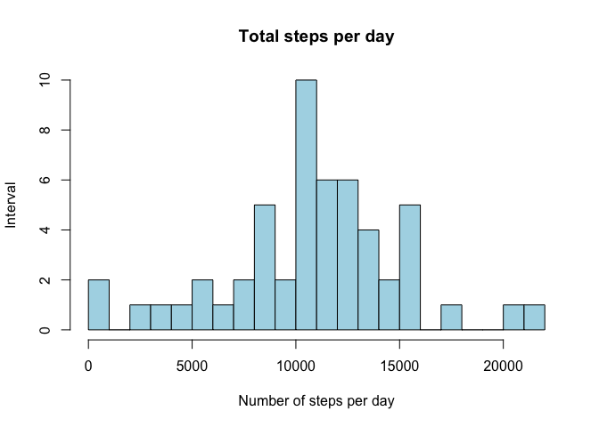
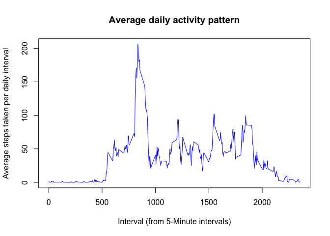
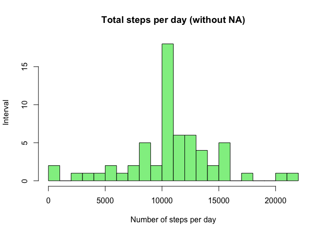
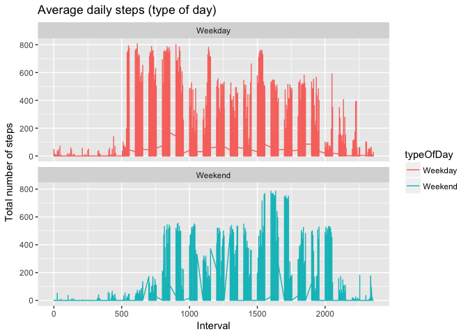

# Reproducible Research: Peer Assessment 1


## Required libraries.


```r
library(knitr)
library(ggplot2)
library(plyr)
library(dplyr)
```

```
## 
## Attaching package: 'dplyr'
```

```
## The following objects are masked from 'package:plyr':
## 
##     arrange, count, desc, failwith, id, mutate, rename, summarise,
##     summarize
```

```
## The following objects are masked from 'package:stats':
## 
##     filter, lag
```

```
## The following objects are masked from 'package:base':
## 
##     intersect, setdiff, setequal, union
```

## Loading and preprocessing the data.

#### 1. Load the data.


```r
setwd("~/Desktop/coursera/Reproducible_Research/RepData_PeerAssessment1")
unzip(zipfile="activity.zip")
activityData<-read.csv("activity.csv")
```

#### 2. Process/transform the data (if necessary) into a format suitable for your analysis.


```r
## Convert dates to "Year-Month-Day" format.
activityData$date <- as.Date(activityData$date, "%Y-%m-%d")
```

## What is mean total number of steps taken per day?


#### 1. Calculate the total number of steps taken per day.


```r
stepsPerDay <- aggregate(steps ~ date, data = activityData, FUN = sum, na.rm = TRUE)
stepsPerDay
```

```
##          date steps
## 1  2012-10-02   126
## 2  2012-10-03 11352
## 3  2012-10-04 12116
## 4  2012-10-05 13294
## 5  2012-10-06 15420
## 6  2012-10-07 11015
## 7  2012-10-09 12811
## 8  2012-10-10  9900
## 9  2012-10-11 10304
## 10 2012-10-12 17382
## 11 2012-10-13 12426
## 12 2012-10-14 15098
## 13 2012-10-15 10139
## 14 2012-10-16 15084
## 15 2012-10-17 13452
## 16 2012-10-18 10056
## 17 2012-10-19 11829
## 18 2012-10-20 10395
## 19 2012-10-21  8821
## 20 2012-10-22 13460
## 21 2012-10-23  8918
## 22 2012-10-24  8355
## 23 2012-10-25  2492
## 24 2012-10-26  6778
## 25 2012-10-27 10119
## 26 2012-10-28 11458
## 27 2012-10-29  5018
## 28 2012-10-30  9819
## 29 2012-10-31 15414
## 30 2012-11-02 10600
## 31 2012-11-03 10571
## 32 2012-11-05 10439
## 33 2012-11-06  8334
## 34 2012-11-07 12883
## 35 2012-11-08  3219
## 36 2012-11-11 12608
## 37 2012-11-12 10765
## 38 2012-11-13  7336
## 39 2012-11-15    41
## 40 2012-11-16  5441
## 41 2012-11-17 14339
## 42 2012-11-18 15110
## 43 2012-11-19  8841
## 44 2012-11-20  4472
## 45 2012-11-21 12787
## 46 2012-11-22 20427
## 47 2012-11-23 21194
## 48 2012-11-24 14478
## 49 2012-11-25 11834
## 50 2012-11-26 11162
## 51 2012-11-27 13646
## 52 2012-11-28 10183
## 53 2012-11-29  7047
```

#### 2. Make a histogram of the total number of steps taken each day.


```r
hist(stepsPerDay$steps, 
     main   = "Total steps per day", 
     xlab   = "Number of steps per day", 
     ylab   = "Interval",
     col    = "light blue",
     breaks = 25)
```

<!-- -->

#### 3. Calculate and report the mean and median of the total number of steps taken per day


```r
## Mean of total steps per day.
meanSteps <- mean(stepsPerDay$steps)
meanSteps
```

```
## [1] 10766.19
```


```r
## Median of total steps per day.
medianSteps <- median(stepsPerDay$steps)
medianSteps
```

```
## [1] 10765
```

## What is the average daily activity pattern?

#### 1. Make a time series plot (i.e. 𝚝𝚢𝚙𝚎 = "𝚕") of the 5-minute interval (x-axis) and the average number of steps taken, averaged across all days (y-axis).


```r
## Five minutes average using steps to interval.
stepsPerInterval <- aggregate(steps ~ interval, data = activityData, FUN = mean, na.rm = TRUE)
plot(x    = stepsPerInterval$interval, 
     y    = stepsPerInterval$steps, 
     type = "l", 
     col  = "blue",
     xlab = "Interval (from 5-Minute intervals)",
     ylab = "Average steps taken per daily interval",
     main = "Average daily activity pattern")
```

<!-- -->

#### 2. Which 5-minute interval, on average across all the days in the dataset, contains the maximum number of steps?


```r
maximumSteps <- stepsPerInterval$interval[which.max(stepsPerInterval$steps)]
maximumSteps
```

```
## [1] 835
```

## Imputing missing values
Note that there are a number of days/intervals where there are missing values (coded as 𝙽𝙰). The presence of missing days may introduce bias into some calculations or summaries of the data.

#### 1. Calculate and report the total number of missing values in the dataset (i.e. the total number of rows with 𝙽𝙰s)


```r
## Sum of all the "NA" in activityData
missingValues <- sum(is.na(activityData$steps))
missingValues
```

```
## [1] 2304
```

#### 2. Devise a strategy for filling in all of the missing values in the dataset. The strategy does not need to be sophisticated. For example, you could use the mean/median for that day, or the mean for that 5-minute interval, etc.


```r
# Calculate the mean for 5-minute intervals excluding NAs.
naRows <- is.na(activityData$steps)
averageIntervalValues <- tapply(activityData$steps,
                                activityData$interval,
                                mean,
                                na.rm    = TRUE,
                                simplify = TRUE)
```

#### 3. Create a new dataset that is equal to the original dataset but with the missing data filled in.


```r
# Creates new dataset and fill NA rows with average calculated previously.
activityDataFilled <- activityData
activityDataFilled$steps[naRows] <- averageIntervalValues[as.character(activityDataFilled$interval[naRows])]

## Check NA filled. Sum of NA in the new dataset must be 0.
sum(is.na(activityDataFilled))
```

```
## [1] 0
```

#### 4. Make a histogram of the total number of steps taken each day and Calculate and report the mean and median total number of steps taken per day. Do these values differ from the estimates from the first part of the assignment? What is the impact of imputing missing data on the estimates of the total daily number of steps?


```r
## Same analysis filling NA values with calculated average.
stepsPerDay2 <- aggregate(steps ~ date, data = activityDataFilled, FUN = sum, na.rm = TRUE)
stepsPerDay2
```

```
##          date    steps
## 1  2012-10-01 10766.19
## 2  2012-10-02   126.00
## 3  2012-10-03 11352.00
## 4  2012-10-04 12116.00
## 5  2012-10-05 13294.00
## 6  2012-10-06 15420.00
## 7  2012-10-07 11015.00
## 8  2012-10-08 10766.19
## 9  2012-10-09 12811.00
## 10 2012-10-10  9900.00
## 11 2012-10-11 10304.00
## 12 2012-10-12 17382.00
## 13 2012-10-13 12426.00
## 14 2012-10-14 15098.00
## 15 2012-10-15 10139.00
## 16 2012-10-16 15084.00
## 17 2012-10-17 13452.00
## 18 2012-10-18 10056.00
## 19 2012-10-19 11829.00
## 20 2012-10-20 10395.00
## 21 2012-10-21  8821.00
## 22 2012-10-22 13460.00
## 23 2012-10-23  8918.00
## 24 2012-10-24  8355.00
## 25 2012-10-25  2492.00
## 26 2012-10-26  6778.00
## 27 2012-10-27 10119.00
## 28 2012-10-28 11458.00
## 29 2012-10-29  5018.00
## 30 2012-10-30  9819.00
## 31 2012-10-31 15414.00
## 32 2012-11-01 10766.19
## 33 2012-11-02 10600.00
## 34 2012-11-03 10571.00
## 35 2012-11-04 10766.19
## 36 2012-11-05 10439.00
## 37 2012-11-06  8334.00
## 38 2012-11-07 12883.00
## 39 2012-11-08  3219.00
## 40 2012-11-09 10766.19
## 41 2012-11-10 10766.19
## 42 2012-11-11 12608.00
## 43 2012-11-12 10765.00
## 44 2012-11-13  7336.00
## 45 2012-11-14 10766.19
## 46 2012-11-15    41.00
## 47 2012-11-16  5441.00
## 48 2012-11-17 14339.00
## 49 2012-11-18 15110.00
## 50 2012-11-19  8841.00
## 51 2012-11-20  4472.00
## 52 2012-11-21 12787.00
## 53 2012-11-22 20427.00
## 54 2012-11-23 21194.00
## 55 2012-11-24 14478.00
## 56 2012-11-25 11834.00
## 57 2012-11-26 11162.00
## 58 2012-11-27 13646.00
## 59 2012-11-28 10183.00
## 60 2012-11-29  7047.00
## 61 2012-11-30 10766.19
```


```r
hist(stepsPerDay2$steps, 
     main   = "Total steps per day (without NA)", 
     xlab   = "Number of steps per day", 
     ylab   = "Interval",
     col    = "light green",
     breaks = 25)
```

<!-- -->


```r
## - Do these values differ from the estimates from the first part of the assignment?
```

By imputing values in rows with NA, we are considering more days with informed data.


```r
## - What is the impact of imputing missing data on the estimates of the total daily number of steps?
```

Considering the summary of both dataset, the differences are mainly in quantiles:


```r
summary(stepsPerDay)
```

```
##       date                steps      
##  Min.   :2012-10-02   Min.   :   41  
##  1st Qu.:2012-10-16   1st Qu.: 8841  
##  Median :2012-10-29   Median :10765  
##  Mean   :2012-10-30   Mean   :10766  
##  3rd Qu.:2012-11-16   3rd Qu.:13294  
##  Max.   :2012-11-29   Max.   :21194
```

```r
summary(stepsPerDay2)
```

```
##       date                steps      
##  Min.   :2012-10-01   Min.   :   41  
##  1st Qu.:2012-10-16   1st Qu.: 9819  
##  Median :2012-10-31   Median :10766  
##  Mean   :2012-10-31   Mean   :10766  
##  3rd Qu.:2012-11-15   3rd Qu.:12811  
##  Max.   :2012-11-30   Max.   :21194
```

## Are there differences in activity patterns between weekdays and weekends?

#### 1. Create a new factor variable in the dataset with two levels – “weekday” and “weekend” indicating whether a given date is a weekday or weekend day.


```r
## Add the new field for calculated value: weekend/weekday
activityDataFilled<- activityDataFilled%>%
        mutate(typeOfDay = ifelse(weekdays(activityDataFilled$date) == "sábado" |
                                  weekdays(activityDataFilled$date) == "domingo", "Weekend",
                            "Weekday"))
activityDataFilled$typeOfDay <- as.factor(activityDataFilled$typeOfDay)
head(activityDataFilled)
```

```
##       steps       date interval typeOfDay
## 1 1.7169811 2012-10-01        0   Weekday
## 2 0.3396226 2012-10-01        5   Weekday
## 3 0.1320755 2012-10-01       10   Weekday
## 4 0.1509434 2012-10-01       15   Weekday
## 5 0.0754717 2012-10-01       20   Weekday
## 6 2.0943396 2012-10-01       25   Weekday
```

#### 2. Make a panel plot containing a time series plot (i.e. 𝚝𝚢𝚙𝚎 = "𝚕") of the 5-minute interval (x-axis) and the average number of steps taken, averaged across all weekday days or weekend days (y-axis).


```r
## Time series plot
ggplot(activityDataFilled,
       aes(x = interval, y = steps, color = typeOfDay)) +
       geom_line() +
       xlab ("Interval") +
       ylab ("Total number of steps") +
       facet_wrap(~ typeOfDay, ncol = 1, nrow = 2) +
       ggtitle("Average daily steps (type of day)")
```

<!-- -->
